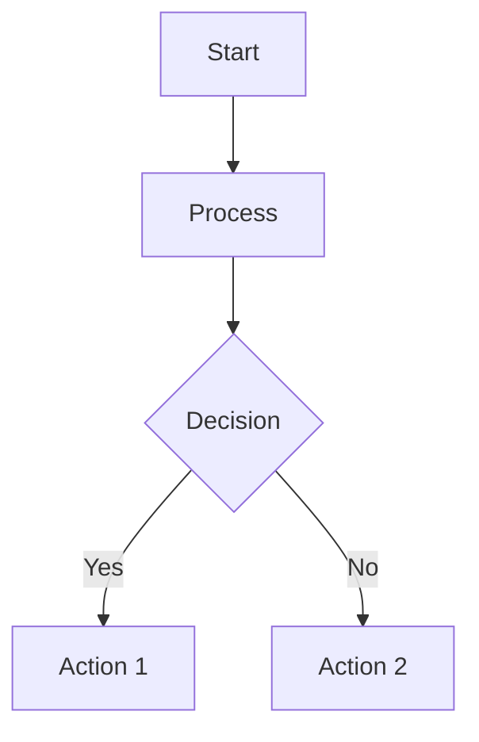

# Notion-Based Learning Notes Skill

## Core Purpose

Transform learning conversations into well-structured, Notion-compatible documentation through artifacts with version control.

---

## Output Format Rules

### 1. Heading Structure
```markdown
## 📚 Main Topic (H2 with emoji)
### Subtopic (H3 without emoji)
#### Key Concept (H4 without emoji)
```

**Only H2 headings use emoji** - keeps table of contents clean.

### 2. Code Formatting

- **Inline code**: `variableName`, `functionName()`, technical terms only
- **Code blocks**: For actual code examples
- **Non-code emphasis**: Use **bold** or block quotes, NOT inline code

### 3. Block Quotes for Callouts
```markdown
> 💡 Important Note
> Key insight or principle

> ⚠️ Warning
> Common pitfall

> ✅ Best Practice
> Recommended approach
```

### 4. Diagrams

**Use Mermaid for:**
- Process flows
- Component hierarchies
- State transitions
- Sequence diagrams


**Use ASCII only for:**
- Simple boxes/lists (max 3-4 rows)
- Linear structures

✅ Good ASCII:
```
┌──────────────────────────┐
│ Item 1 → Value A         │
│ Item 2 → Value B         │
│ Item 3 → Value C         │
└──────────────────────────┘
```

**ASCII Verification:**
- [ ] All corners (┌ ┐ └ ┘) aligned?
- [ ] All vertical bars (│) in same column?
- [ ] All horizontal bars (─) same length?
- [ ] Spacing consistent?

### 5. Tables

Use standard Markdown syntax:
```markdown
| Column 1 | Column 2 | Column 3 |
|----------|----------|----------|
| Data A   | Data B   | Data C   |
```

---

## Language Rules

### Bilingual Terms

**Format**: Korean (English)

Examples: 상태(State), 훅(Hook), 렌더링(Rendering)

### Sentence Style

**Use noun-ending, NOT sentence-ending**

❌ Wrong: useState는 상태를 관리합니다.
✅ Correct: useState를 통한 상태 관리

---

## Content Organization

### Structure for Understanding (Not Learning Flow)

Organize by logical concept hierarchy, not chronological order.

Example:
```markdown
## 📚 React Hooks

### 기본 훅(Basic Hooks)
#### useState - 상태 관리
#### useEffect - 사이드 이펙트

### 고급 훅(Advanced Hooks)
#### useMemo - 성능 최적화
```

### Include Practical Examples
```markdown
### useState - 상태 관리

**개념**
컴포넌트가 기억해야 할 값을 저장하는 훅(Hook)

**예시**
\`\`\`javascript
const [count, setCount] = useState(0);
\`\`\`

**활용**
- 폼 입력값 관리
- 토글 상태
```

### Clear H3 Titles

H3 should convey meaning without reading content.

❌ Vague: "### 기본 사용법"
✅ Clear: "### useState 선언과 상태 업데이트 방법"

---

## Process

### Step 1: Analyze Content
```
📝 Content Analysis

Key Topics:
- [Topic 1]
- [Topic 2]

Concepts to Include:
- [Concept A]
- [Concept B]
```

### Step 2: Plan Structure
```
📊 Document Structure

Main Sections:
1. [Section 1 with emoji]
2. [Section 2 with emoji]

Subsections:
- Section 1: [X subsections]
- Section 2: [Y subsections]
```

### Step 3: Generate Artifact

Type: `text/markdown`

### Step 4: Quality Check

**Immediately verify after artifact creation:**
```
🔍 Quality Verification

✓ Artifact displays correctly
✓ No Markdown syntax errors
✓ Code blocks properly formatted
✓ Tables render correctly
✓ Diagrams verified (Mermaid/ASCII)
✓ H2 only has emoji
✓ Bilingual format: Korean (English)
✓ Noun-ending style throughout
✓ Remove empty line at end of code block

Status: [Pass / Issues Found]
```

**If issues found**: List errors, fix immediately, re-verify.

### Step 5: Report
```
✅ 학습 노트 생성 완료

📄 제목: [Title]
📏 구조: [X]개 섹션, [Y]개 하위 주제
🎯 주요 내용: [Topic 1], [Topic 2], [Topic 3]
```

---

## Template
```markdown
# [Main Topic]

> 📌 개요
> [1-2 sentence introduction]

---

## 📚 [Section - Core Concepts]

### [Concept A]

**정의**
[Definition]

**예시**
\`\`\`javascript
// Code
\`\`\`

**활용**
- Use case 1
- Use case 2

---

## 🔧 [Section - Application]

### [Application A]

**상황**
[When to use]

**구현**
\`\`\`javascript
// Implementation
\`\`\`

> ⚠️ 주의
> [Warning]

---

## 💡 [Section - Best Practices]

| 항목 | 권장 | 비권장 |
|------|------|--------|
| A    | Do   | Don't  |

**프로세스**

\`\`\`mermaid
graph LR
    A[단계1] --> B[단계2]
    B --> C[단계3]
\`\`\`
```

---

## Update Protocol
```
🔄 업데이트 v[X] → v[X+1]

변경사항:
- [Change 1]
- [Change 2]

재검증: 완료
```

Version in artifact:
```markdown
---
Version: 1.0
Last Updated: 2025-12-18
Topic: [Topic]
---
```

---

## Quality Checklist

- [ ] Artifact displays correctly
- [ ] No Markdown errors
- [ ] Code blocks closed
- [ ] Tables render
- [ ] Diagrams verified (Mermaid/ASCII)
- [ ] H2 only has emoji
- [ ] Korean (English) format
- [ ] Noun-ending style
- [ ] Examples included
- [ ] Remove empty line at end of code block