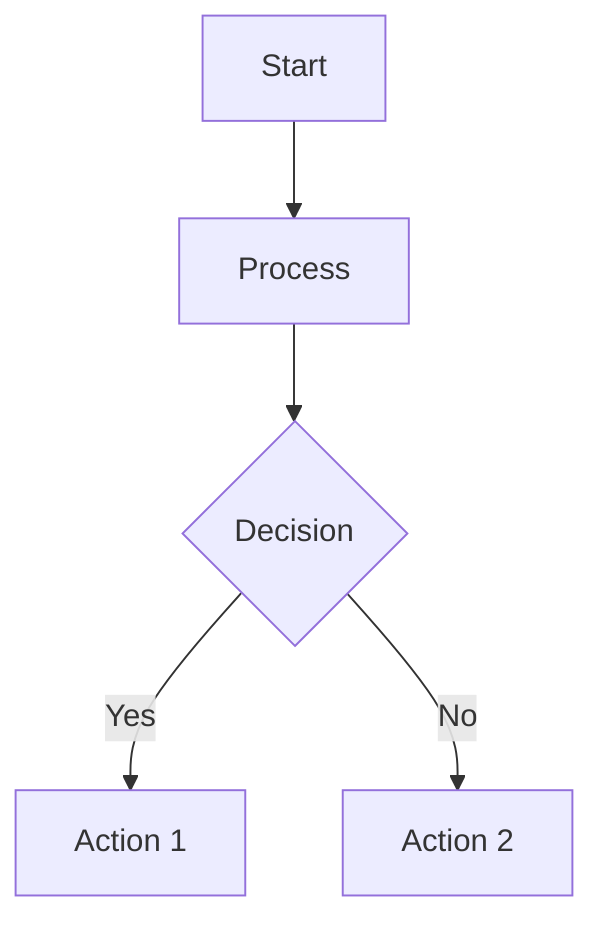

# Notion-Based Learning Notes Skill

## Core Purpose

학습 대화를 **Notion MCP 커넥터를 통해 사용자가 지정한 위치에 직접 페이지로 생성**한다. 사용자는 위치(페이지 또는 데이터베이스)만 알려주면 되고, 본문 작성·메타데이터 입력·중복 확인·링크 반환까지 스킬이 모두 수행한다.

> 💡 핵심 변경
> 이 스킬은 더 이상 "붙여넣기용 마크다운"을 출력하지 않는다. MCP 도구를 호출해 실제 페이지를 생성한다.

---

## Required MCP Tools

| 도구 | 용도 |
|------|------|
| `mcp__claude_ai_Notion__notion-search` | 부모 위치를 이름으로 찾기 / 중복 제목 검사 |
| `mcp__claude_ai_Notion__notion-fetch` | 페이지 또는 데이터베이스 스키마 검증 |
| `mcp__claude_ai_Notion__notion-create-pages` | 학습 노트 페이지 생성 |
| `mcp__claude_ai_Notion__notion-update-page` | (선택) 기존 페이지에 내용 추가 |

> ⚠️ MCP 미연결 시
> Notion MCP가 활성화되어 있지 않으면 사용자에게 한국어로 안내하고, 기존 방식(마크다운 출력)으로 폴백할지 묻는다. 강제로 호출 시도하지 않는다.

---

## Process

### Step 1: Parent Location 결정

#### Case A — 사용자 입력에 URL 또는 명확한 페이지명이 있다

추가 확인 없이 **바로 Step 2로 진행**. 마찰을 만들지 않는다.

- URL이면: `page_id` 또는 `data_source_id`로 사용
- 페이지명만 있으면: `notion-search`로 1회 조회 후 가장 명확한 매치 채택. 다중 매치 시에만 사용자에게 어느 것인지 확인

#### Case B — 위치 정보가 없다

다음 한국어 프롬프트를 사용자에게 보낸다:

```
노션 내 어디에 정리해드릴까요?

옵션 A — 기존 페이지 아래 자식 페이지로 (URL을 알려주세요)
옵션 B — 학습 노트 데이터베이스에 새 행으로 (DB URL을 알려주세요)
옵션 C — 이름으로 찾기 (예: "TIL", "학습 노트")

URL을 알고 계시면 바로 붙여 넣어주셔도 됩니다.
```

### Step 2: Parent 타입 판별 + 스키마 확인

1. URL 패턴으로 페이지/데이터베이스 1차 추정
2. 모호하거나 데이터베이스인 경우 `notion-fetch` 호출로 검증
3. 데이터베이스라면 schema에서 `properties` 목록 확보
   - Title 필드(필수)
   - Date / Tags / Category 등(있으면 활용)

### Step 3: 콘텐츠 분석 + 구조 설계

학습 내용에서 핵심 토픽을 추출하고 H2/H3 계층을 설계한다. 사용자에게 한국어로 짧게 노출:

```
다음 구조로 정리하겠습니다:

📚 [Topic 1]
  - [Subtopic A]
  - [Subtopic B]

🔧 [Topic 2]
  - [Subtopic C]

진행할까요?
```

### Step 4: 중복 제목 검사 (BLOCKING)

페이지 생성 직전에 `notion-search`로 **동일 부모 + 동일 제목** 존재 여부를 확인한다.

> ⚠️ 이 단계는 건너뛰지 않는다.
> 같은 제목 페이지가 있는데 그대로 새로 만들면 사용자 워크스페이스가 어지러워진다.

존재 시 한국어로 묻는다:

```
"<제목>" 페이지가 이미 있습니다. 어떻게 진행할까요?

1) 기존 페이지에 내용 추가
2) 새 페이지로 생성 (제목 뒤 "(v2)" 또는 날짜 추가)
3) 취소
```

### Step 5: Notion 페이지 생성

#### A. 부모가 일반 페이지인 경우

```
mcp__claude_ai_Notion__notion-create-pages
  parent: { page_id: "<page-uuid 또는 URL>" }
  pages: [{
    properties: { "title": "<문서 제목>" },
    content: "<마크다운 본문 — Content Formatting Rules 준수>"
  }]
```

#### B. 부모가 데이터베이스인 경우

Step 2에서 확보한 schema 필드명을 properties 키로 사용한다.

```
mcp__claude_ai_Notion__notion-create-pages
  parent: { data_source_id: "collection://<uuid>" }
  pages: [{
    properties: {
      "<Title 필드명>": "<제목>",
      "<Tags 필드명>": "<태그>",
      "date:<Date 필드명>:start": "<YYYY-MM-DD>",
      "date:<Date 필드명>:is_datetime": 0
    },
    content: "<마크다운 본문>"
  }]
```

> 💡 properties 매핑 원칙
> schema에 없는 필드는 만들지 않는다. 알 수 없는 필드는 비워두고, 사용자가 직접 보강하도록 결과 보고에서 안내한다.

### Step 6: 결과 검증 + 보고

생성 응답에서 페이지 URL을 추출해 한국어로 보고한다:

```
✅ 학습 노트 생성 완료

제목: <Title>
위치: <부모 페이지명 또는 데이터베이스명>
링크: <Notion URL>
구조: <X>개 섹션, <Y>개 하위 주제
주요 내용: <Topic 1>, <Topic 2>, <Topic 3>
```

### Step 7 (선택): 인덱스 페이지 갱신

사용자가 **명시적으로 요청한 경우에만** 진행한다. 별도 허브/인덱스 페이지에 `notion-update-page`로 `<mention-page url="...">` 링크를 추가한다.

---

## Content Formatting Rules

> 💡 이 규칙은 Notion 페이지 본문(`content` 필드)에 그대로 적용된다.
> Notion은 표준 마크다운 + Mermaid를 지원하므로 아래 규칙이 그대로 렌더링된다.

### 1. Heading Structure

```markdown
## 📚 Main Topic (H2 with emoji)
### Subtopic (H3 without emoji)
#### Key Concept (H4 without emoji)
```

**H2 헤딩에만 이모지** — 목차가 깔끔해진다.

### 2. Code Formatting

- **Inline code**: `variableName`, `functionName()` 등 기술 식별자에만 사용
- **Code blocks**: 실제 코드 예시
- **Non-code emphasis**: **굵게** 또는 인용구 사용. 인라인 코드 남용 금지

### 3. Block Quotes for Callouts

```markdown
> 💡 Important Note
> 핵심 인사이트나 원칙

> ⚠️ Warning
> 흔한 함정

> ✅ Best Practice
> 권장 접근법
```

### 4. Diagrams

**Mermaid 사용 대상:**
- 프로세스 흐름
- 컴포넌트 계층
- 상태 전이
- 시퀀스 다이어그램


```mermaid
graph TD
    A[Start] --> B[Process]
    B --> C{Decision}
    C -->|Yes| D[Action 1]
    C -->|No| E[Action 2]
```

**ASCII는 단순 박스/리스트(3~4행 이내)에만:**

```
┌──────────────────────────┐
│ Item 1 → Value A         │
│ Item 2 → Value B         │
│ Item 3 → Value C         │
└──────────────────────────┘
```

**ASCII 검증:**
- [ ] 모서리(┌ ┐ └ ┘) 정렬?
- [ ] 수직 바(│)가 같은 컬럼?
- [ ] 수평 바(─)가 같은 길이?
- [ ] 간격 일관성?

### 5. Tables

표준 Markdown 문법 사용:

```markdown
| Column 1 | Column 2 | Column 3 |
|----------|----------|----------|
| Data A   | Data B   | Data C   |
```

---

## Language Rules

### Bilingual Terms

**형식**: 한국어(English)

예시: 상태(State), 훅(Hook), 렌더링(Rendering)

### Sentence Style

**명사형 종결, 문장형 종결 금지**

- ❌ Wrong: useState는 상태를 관리합니다.
- ✅ Correct: useState를 통한 상태 관리

---

## Content Organization

### Structure for Understanding (Not Learning Flow)

학습 순서가 아니라 **논리적 개념 계층**으로 구성한다.

```markdown
## 📚 React Hooks

### 기본 훅(Basic Hooks)
#### useState — 상태 관리
#### useEffect — 사이드 이펙트

### 고급 훅(Advanced Hooks)
#### useMemo — 성능 최적화
```

### Include Practical Examples

```markdown
### useState — 상태 관리

**개념**
컴포넌트가 기억해야 할 값을 저장하는 훅(Hook)

**예시**
\`\`\`javascript
const [count, setCount] = useState(0);
\`\`\`

**활용**
- 폼 입력값 관리
- 토글 상태
```

### Clear H3 Titles

H3는 본문을 읽지 않아도 의미가 전달되어야 한다.

- ❌ Vague: `### 기본 사용법`
- ✅ Clear: `### useState 선언과 상태 업데이트 방법`

---

## Update Protocol

기존 학습 노트를 보강할 때:

1. 사용자가 노트 URL과 함께 "보강해줘"라고 하면 `notion-update-page`로 섹션 단위 추가
2. 페이지 상단에 **변경 이력** 누적

```markdown
**변경 이력**
- 2026-05-17: useReducer 섹션 추가
- 2026-04-30: 초기 작성
```

---

## Template

```markdown
# [Main Topic]

> 📌 개요
> [1~2 문장 도입]

---

## 📚 [Section — Core Concepts]

### [Concept A]

**정의**
[정의]

**예시**
\`\`\`javascript
// Code
\`\`\`

**활용**
- Use case 1
- Use case 2

---

## 🔧 [Section — Application]

### [Application A]

**상황**
[언제 사용]

**구현**
\`\`\`javascript
// Implementation
\`\`\`

> ⚠️ 주의
> [Warning]

---

## 💡 [Section — Best Practices]

| 항목 | 권장 | 비권장 |
|------|------|--------|
| A    | Do   | Don't  |

**프로세스**

\`\`\`mermaid
graph LR
    A[단계1] --> B[단계2]
    B --> C[단계3]
\`\`\`
```

---

## Quality Checklist

페이지 생성 직후 검증한다:

- [ ] 부모 위치 ID/URL 검증됨 (`notion-fetch` 성공)
- [ ] 데이터베이스인 경우 schema 조회 완료
- [ ] 중복 제목 검사 완료
- [ ] `notion-create-pages` 호출 성공 + URL 반환됨
- [ ] H2만 이모지, H3 이하 평문
- [ ] 한국어(English) bilingual 표기 유지
- [ ] 명사형 종결 스타일 유지
- [ ] Mermaid / ASCII 다이어그램 검증
- [ ] 코드 블록 닫힘 및 trailing 빈 줄 제거
- [ ] 사용자에게 페이지 링크 보고됨

문제 발견 시: 한국어로 알리고 `notion-update-page`로 수정 후 재검증.

---

## Error Handling

| 상황 | 대응 |
|------|------|
| MCP 미연결 | 사용자에게 한국어로 알리고 기존 artifact(마크다운 출력) 방식으로 폴백할지 확인 |
| 부모 URL 무효 | `notion-fetch` 실패 시 사용자에게 URL 재확인 요청 |
| 권한 거부 | 한국어로 명확히 안내하고 다른 부모 선택 권유 |
| 데이터베이스 properties 불일치 | 필수 필드(Title)만 채우고 나머지는 비워둠. 결과 보고에서 사용자에게 보강 요청 |
| `notion-search` 다중 매치 | 후보를 한국어 목록으로 노출 후 사용자에게 선택 요청 |

---

## Final Report Template

```
✅ 학습 노트 생성 완료

📄 제목: <Title>
📂 위치: <Parent Name>
🔗 링크: <Notion URL>
📏 구조: <X>개 섹션, <Y>개 하위 주제
🎯 주요 내용: <Topic 1>, <Topic 2>, <Topic 3>
```
